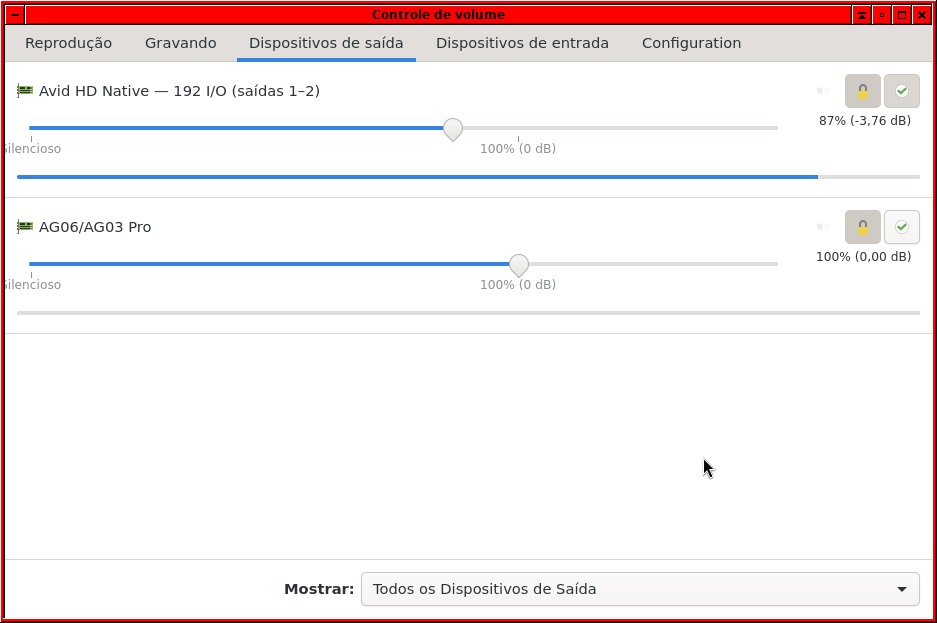

# Reprodução nos aplicativos confirmada — 20/09/2026

O usuário confirmou funcionamento em **Harrison MixBus 12, Audacious e áudio
no navegador**. A imagem fornecida mostra a saída “Avid HD Native — 192 I/O
(saídas 1–2)” no controle de volume, com atividade no medidor, ao lado da
Yamaha AG06/AG03. O volume exibido da HD Native é 87% (−3,76 dB), ajustado
pelo usuário após o nível inicial de −40 dB.

## Evidência do driver

Os logs locais de `desktop-session-20260920-182735` registram:

- **6 partidas e 6 paradas**, além de preparos sem início de stream.
- **59017058 quadros consumidos**, equivalentes nominalmente a 20min29,52s
  de PCM acumulado a 48 kHz; inclui eventuais períodos silenciosos mantidos
  pelo PipeWire, não mede duração da música ouvida.
- Último stream: **35106416 quadros**, cerca de **12min11,38s**, demonstrando
  reprodução além do antigo limite de 360 segundos.
- **7201 voltas completas** somadas do anel; **zero XRUNs e zero erros**
  registrados pelo driver.
- Maior intervalo de polling: **2508 µs**; não é uma medida de latência total.
- Mute e rota restaurados ao encerrar. Módulo removido, PCI sem driver,
  cabeçalhos antes/depois idênticos e lista de erros de limpeza vazia.

A configuração de sessão registra `ready=true`, saída `avid_hd_native_192`
e seleção dessa saída como padrão antes da desativação. A diferença entre
quadros enfileirados e consumidos em algumas paradas não é automaticamente
perda de áudio: o encerramento pode descartar o trecho ainda pendente.
Os logs não correlacionam cada stream com um aplicativo específico; os
nomes dos três aplicativos vêm da confirmação do usuário.

Fonte, helpers, módulo, gerenciador, configuração e scripts foram conferidos
contra os hashes do build antes desta atualização documental.
Módulo validado SHA256:
`ab08d77dfc1bebc4470e21436ba2c1c99eb27002b3f36f0c80d36d3b293acb6f`.

## Evidências

- Estado final e restauração PCI (`desktop-session-20260920-182735/session.json`; evidência local não incluída).
- Contadores após fechar o áudio (`desktop-session-20260920-182735/after-close-stats.json`; evidência local não incluída).
- Log do módulo (`desktop-session-20260920-182735/module.log`; evidência local não incluída).
- [Instruções para ativar/desativar](../desktop/README.md).

O uso de reprodução por aplicativos, sem sudo por aplicativo, está validado
neste ambiente: kernel 6.12.107+deb13-amd64, PipeWire 1.4.2, WirePlumber 0.5.8,
HD Native PCIe e 192 no estado de 48 kHz já usado na pesquisa. Permanecem
pendentes captura, outros canais/taxas, partida a frio e medições de
qualidade e latência. O módulo continua experimental e sem carga automática
no boot. Nenhum código ou configuração funcional foi alterado neste marco.
